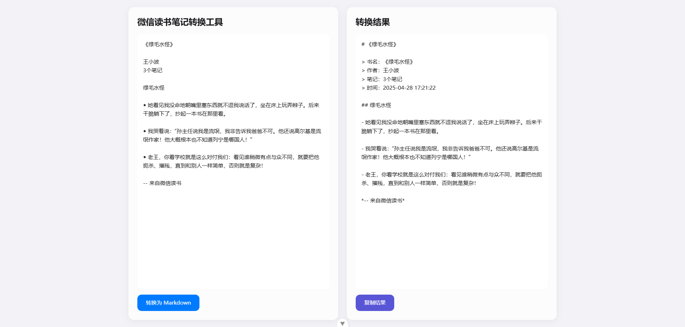
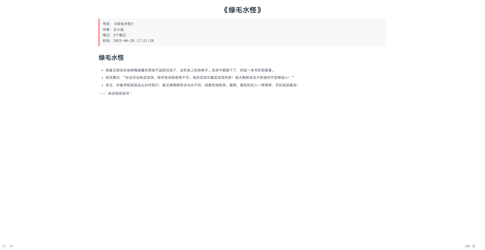

# 微信读书笔记转换工具

这是一个将微信读书笔记转换为 Markdown 格式的工具，基于 Vue 3 + Vite 开发。

## 功能特点

- 支持导入微信读书笔记
- 自动转换为 Markdown 格式
- 保留笔记的层级结构和格式
- 支持导出为 Markdown 文件

## 开发环境要求

- [VSCode](https://code.visualstudio.com/) + [Volar](https://marketplace.visualstudio.com/items?itemName=Vue.volar) (推荐)
- Node.js 16+
- pnpm 包管理器

## 项目设置

```sh
# 安装依赖
pnpm install

# 启动开发服务器
pnpm dev

# 构建生产版本
pnpm build
```

## 使用说明

1. 从微信读书复制全部笔记
2. 使用本工具粘贴笔记
3. 点击转换按钮
4. 完成转换，复制




## 许可证

MIT
